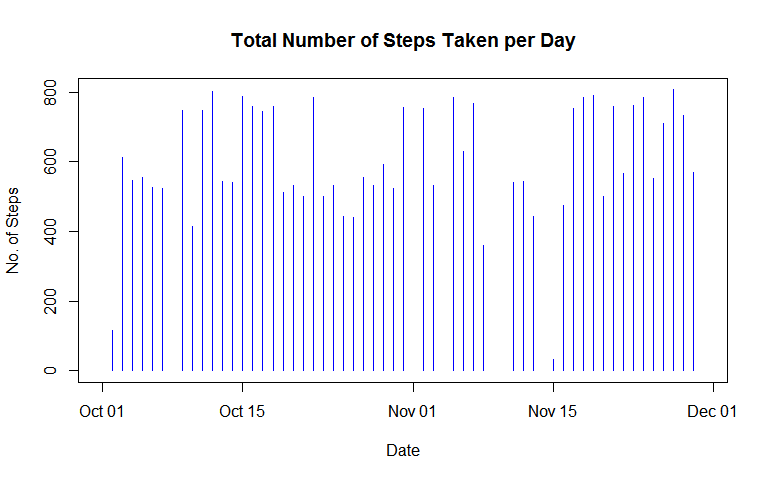
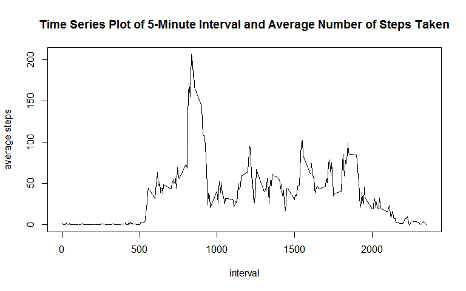
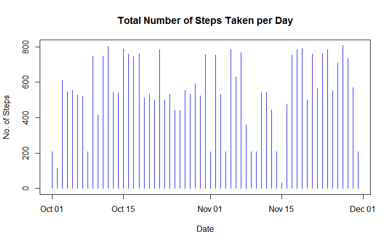
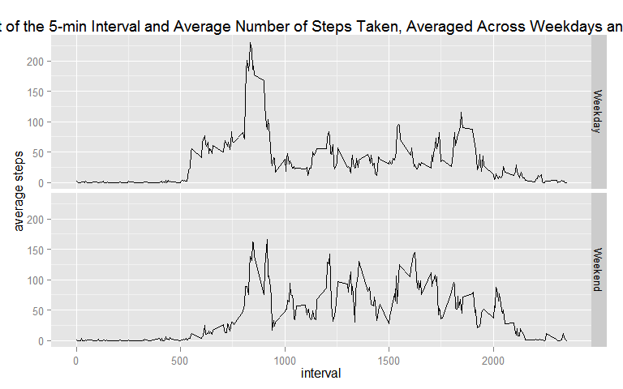

# Reproducible Research: Peer Assessment 1


## Loading and preprocessing the data

```r
#set working directory
setwd("D:/0 Online Courses/Coursera/Data Science Specialization - John Hopkins School of Public Health/05 Reproducible Research/WD")

#loads data
activity_data <- read.csv("data/activity.csv", na.strings="NA")

#convert date variable to represent calendar dates
activity_data$date <- as.Date(activity_data$date)
```


## What is mean total number of steps taken per day?

###1. Make a histogram of the total number of steps taken each day

```r
# 1. Make a histogram of the total number of steps taken each day


#plots histogram of total number of steps taken each day
plot(activity_data$date,activity_data$steps,
     type = "h", 
     col = "Blue", 
     ylab ="No. of Steps", 
     xlab = "Date", 
     main = "Total Number of Steps Taken per Day")
```

 

###2. Calculate and report the mean and median total number of steps taken per day


```r
#calculates mean and median total number of steps taken per day
library(plyr)
meanDay <- ddply(activity_data,"date", 
                 summarise, 
                 mean = mean(steps, na.rm = TRUE))
medianDay <- ddply(activity_data,"date", 
                   summarise, 
                   median = median(steps, na.rm = TRUE))

Q2dat <- join(meanDay, medianDay, by = "date")
```

**MEAN and MEDIAN of Total Number Steps Taken per Day (First 20 results)**

```r
head(Q2dat,20)
```

```
##          date     mean median
## 1  2012-10-01      NaN     NA
## 2  2012-10-02  0.43750      0
## 3  2012-10-03 39.41667      0
## 4  2012-10-04 42.06944      0
## 5  2012-10-05 46.15972      0
## 6  2012-10-06 53.54167      0
## 7  2012-10-07 38.24653      0
## 8  2012-10-08      NaN     NA
## 9  2012-10-09 44.48264      0
## 10 2012-10-10 34.37500      0
## 11 2012-10-11 35.77778      0
## 12 2012-10-12 60.35417      0
## 13 2012-10-13 43.14583      0
## 14 2012-10-14 52.42361      0
## 15 2012-10-15 35.20486      0
## 16 2012-10-16 52.37500      0
## 17 2012-10-17 46.70833      0
## 18 2012-10-18 34.91667      0
## 19 2012-10-19 41.07292      0
## 20 2012-10-20 36.09375      0
```
## What is the average daily activity pattern?

###1. Make a time series plot (i.e. type = "l") of the 5-minute interval (x-axis) and the average number of steps taken, averaged across all days (y-axis)


```r
#1. Make a time series plot (i.e. type = "l") of the 5-minute interval (x-axis) and the average number of steps taken, averaged across all days (y-axis)


#averages steps taken across all days
Q3dat <- ddply(activity_data,
               "interval", 
               summarise, 
               aveSteps = mean(steps, na.rm = TRUE))


#plots line graph for the time series 
plot(Q3dat$interval,Q3dat$aveSteps, 
     type = "l", 
     xlab = "interval", 
     ylab = "average steps",
     main = "Time Series Plot of 5-Minute Interval and Average Number of Steps Taken")
```

 

###2. Which 5-minute interval, on average across all the days in the dataset, contains the maximum number of steps?


```r
#2. Which 5-minute interval, on average across all the days in the dataset, contains the maximum number of steps?

#computes maximum
maximum <- max(Q3dat$aveSteps)

max <- Q3dat[which(Q3dat[,"aveSteps"] == maximum),]
```


```r
max_interval <- max[,1]
max_steps <- max[,2]
```
Interval no. **835** contains the maximum steps with **206.1698113** average steps.

## Imputing missing values

        
###1. Calculate and report the total number of missing values in the dataset (i.e. the total number of rows with NAs)

**No. of Missing Values for Each Variable in the Data**

```r
#Calculate and report missing values in data
colSums(is.na(activity_data))
```

```
##    steps     date interval 
##     2304        0        0
```
*There are 2304 missing values in the Steps variable in the activity_data dataset.*


###2. Devise a strategy for filling in all of the missing values in the dataset. The strategy does not need to be sophisticated. For example, you could use the mean/median for that day, or the mean for that 5-minute interval, etc.

Strategy: Use average steps per interval to fill-in the missing values

```r
#get the missing rows in the data
missing <- is.na(activity_data)
#dat2 extracts all rows with missing values
dat2 <- activity_data[missing,]
#dat3 extracts columns containing the date and interval valus of dat 2
dat3 <- dat2[,2:3]

#used average steps per interval in Q3/QC to fill in the missing values
# merged dat3 and Q3dat (containing the average steps interval from Q3)
dat4 <- join(dat3,Q3dat, by = "interval", type = "left") 
```

###3. Create a new dataset that is equal to the original dataset but with the missing data filled in.


```r
#new data set with the average steps to fill in the missing values
activity_data[missing,1]<-dat4$aveSteps

head(activity_data, 10)
```

```
##        steps       date interval
## 1  1.7169811 2012-10-01        0
## 2  0.3396226 2012-10-01        5
## 3  0.1320755 2012-10-01       10
## 4  0.1509434 2012-10-01       15
## 5  0.0754717 2012-10-01       20
## 6  2.0943396 2012-10-01       25
## 7  0.5283019 2012-10-01       30
## 8  0.8679245 2012-10-01       35
## 9  0.0000000 2012-10-01       40
## 10 1.4716981 2012-10-01       45
```

**Number of Missing Values in New Dataset**

```r
colSums(is.na(activity_data))
```

```
##    steps     date interval 
##        0        0        0
```

###4.1 Make a histogram of the total number of steps taken each day  

```r
#Make a histogram of the total number of steps taken each day
plot(activity_data$date,activity_data$steps,
     type = "h", 
     col = "Blue", 
     ylab ="No. of Steps", 
     xlab = "Date", 
     main = "Total Number of Steps Taken per Day")
```

 

###4.2 Calculate and report the mean and median total number of steps taken per day. 

```r
#Calculate and report the mean and median total number of steps taken per day.
meanDay2 <- ddply(activity_data,"date", 
                 summarise, 
                 mean = mean(steps, na.rm = TRUE))
medianDay2 <- ddply(activity_data,"date", 
                   summarise, 
                   median = median(steps, na.rm = TRUE))

Q4dat <- join(meanDay2, medianDay2, by = "date")
```

**MEAN and MEDIAN of Total Number of Steps Taken (First 20 results)**

```r
head(Q4dat,20)
```

```
##          date     mean   median
## 1  2012-10-01 37.38260 34.11321
## 2  2012-10-02  0.43750  0.00000
## 3  2012-10-03 39.41667  0.00000
## 4  2012-10-04 42.06944  0.00000
## 5  2012-10-05 46.15972  0.00000
## 6  2012-10-06 53.54167  0.00000
## 7  2012-10-07 38.24653  0.00000
## 8  2012-10-08 37.38260 34.11321
## 9  2012-10-09 44.48264  0.00000
## 10 2012-10-10 34.37500  0.00000
## 11 2012-10-11 35.77778  0.00000
## 12 2012-10-12 60.35417  0.00000
## 13 2012-10-13 43.14583  0.00000
## 14 2012-10-14 52.42361  0.00000
## 15 2012-10-15 35.20486  0.00000
## 16 2012-10-16 52.37500  0.00000
## 17 2012-10-17 46.70833  0.00000
## 18 2012-10-18 34.91667  0.00000
## 19 2012-10-19 41.07292  0.00000
## 20 2012-10-20 36.09375  0.00000
```

###4.3 Do these values differ from the estimates from the first part of the assignment? What is the impact of imputing missing data on the estimates of the total daily number of steps?

IT ONLY AFFECT THE ESTIMATES OF DATES WITH MISSING VALUES, ALL OTHERS REMAIN THE SAME. 

## Are there differences in activity patterns between weekdays and weekends?

###1.Create a new factor variable in the dataset with two levels – “weekday” and “weekend” indicating whether a given date is a weekday or weekend day.


```r
activity_data$wday <- as.factor(ifelse(weekdays(activity_data$date) %in% c("Saturday","Sunday"), "Weekend", "Weekday"))

head(activity_data, 10)
```

```
##        steps       date interval    wday
## 1  1.7169811 2012-10-01        0 Weekday
## 2  0.3396226 2012-10-01        5 Weekday
## 3  0.1320755 2012-10-01       10 Weekday
## 4  0.1509434 2012-10-01       15 Weekday
## 5  0.0754717 2012-10-01       20 Weekday
## 6  2.0943396 2012-10-01       25 Weekday
## 7  0.5283019 2012-10-01       30 Weekday
## 8  0.8679245 2012-10-01       35 Weekday
## 9  0.0000000 2012-10-01       40 Weekday
## 10 1.4716981 2012-10-01       45 Weekday
```

###2. Make a panel plot containing a time series plot (i.e. type = "l") of the 5-minute interval (x-axis) and the average number of steps taken, averaged across all weekday days or weekend days (y-axis).

```r
aveSteps3 <- ddply(activity_data, c("interval","wday"), 
                 summarise, 
                 mean = mean(steps, na.rm = TRUE))

library(ggplot2)
qplot(interval, mean, data = aveSteps3, 
      facets = wday ~., 
      geom = "line", 
      ylab = "average steps",
      main = "Panel Plot of the 5-min Interval and Average Number of Steps Taken, Averaged Across Weekdays and Weekends")
```

 
